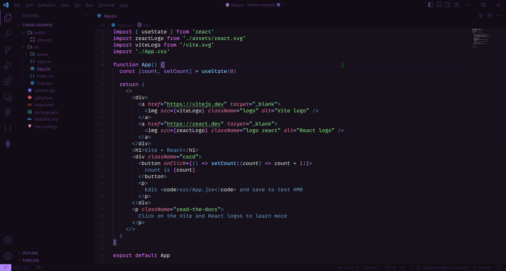

# 💎 Fluorite Theme

  

## 🚀 Installation

- Open the Extensions sidebar in VS Code
- Search for `Fluorite`
- Click Install
- Open the Command Palette with `Ctrl+Shift+P` or `⇧⌘P`
- Select Preferences: Color Theme and choose `Fluorite Theme`.

> 💜 With Love by Rnbsov 👾
